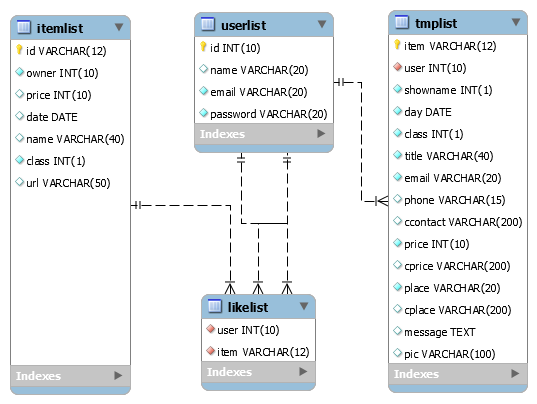
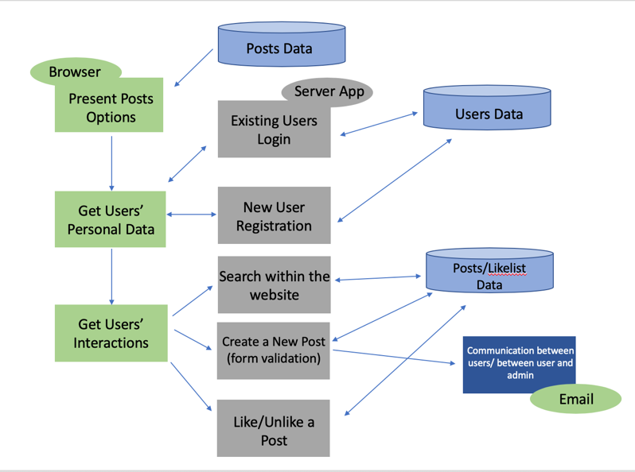
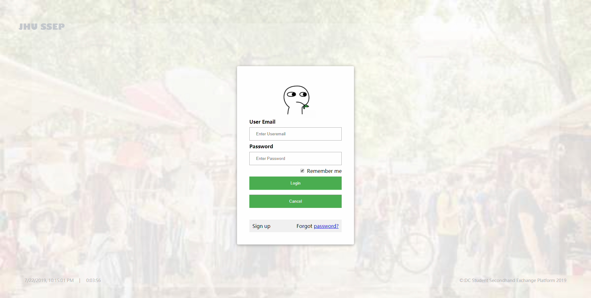
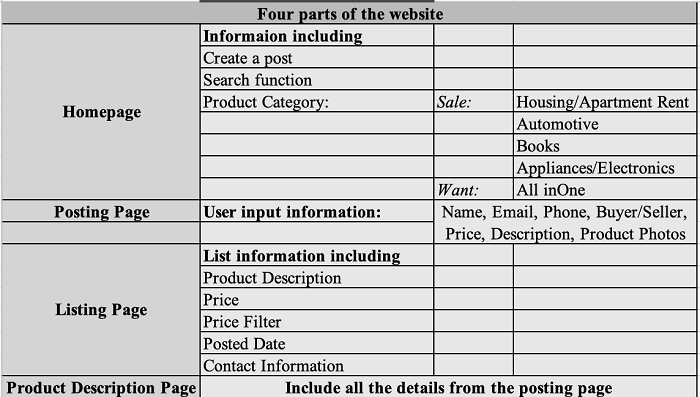
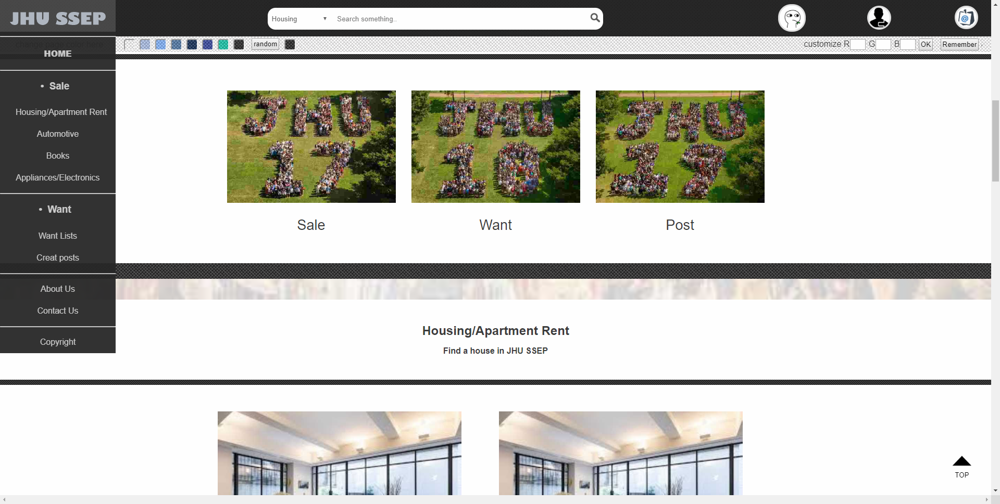
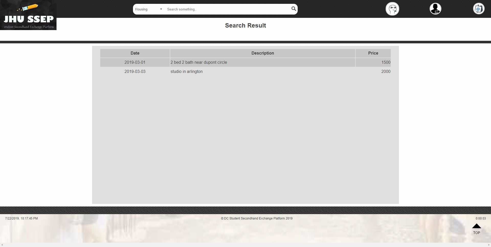
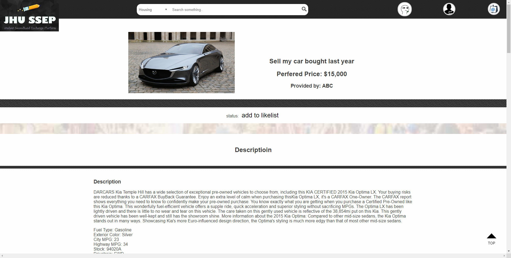
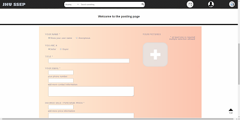

# mini-web-site-for-online-selling
*For online market website construction*  
  
  

This repository includes a website designed in purpose for JHU students as an online platform to exchange secondhand products. It provides platforms for students to sell and buy second-hand (idle) things from each other. This website is launched as a descendant of the university site, that it does not sell or buy any products. Instead, users can publish the items they no longer need, or they want to buy on the website. No online transactions will be made via the platform, users are able to contact the corresponding buyer/seller for further information per methods provided by the publisher and are encouraged to check the items and finish the transaction by themselves. Univeristy students, professors and officers are targeting users of this website.
  

## Getting started

### Usage
The website can perform successfully through popular web browsers, Chrome, Firefox, Safari, etc. without installation after publishing. On mobile devices is also supported. For more stable usage, Chrome is recommended on mobile side.
 

### Testing data
The website is developed based on MySQL, sample data format can be seen in file [seep_sample.sql](seep_sample.sql). It currently has data of four simulated product for purchase or sell. Other testing data of the project are simulated randomly and are not stored in the database. 
 

  
Change of SQL platform may result to invalid SQL data format or failure of query functions on the website.
  
### Resources  
  - Environment: HTML, PHP  
  - SQL: MySQL  
  - Other: JavaScript, CSS knowledge is needed for webpage coding, as well.  
     
  - To setup the website:
    - Import SQL data in file [seep_sample.sql](seep_sample.sql) and complete database account properties setting in `db.properties` in file [login.php](login.php).  
    - Download `.php`, `.html` files, and `css`, `js`, `images`, `iii` folders in targeting folder supporting internet information services.  
     
  - Architecture Overview  
      

## Features

  
The website focus on building platform severing for both sides of buyers and sellers. To build a neat and concise structure of the website, the main features are grouped into six categories (respectively in each webpage) for satisfying different needs of users.  
 

## Login page
For testing purpose, this step can be omitted by mannually typing homepage address, if no sql is setted.  
  
 

## user page:
  
 

## Product webpages:
  
 

## Homepage:
  
 

## List page:
  
 

## item page:
  
 

## post page:
  
  

## Documentation

A detailed user manual, explaining usage instructions of different roles of users is uploaded in `readme_img` folder, [manual.pdf](/readme_img/manual.pdf). For further needs, please read the user manual.   
 
